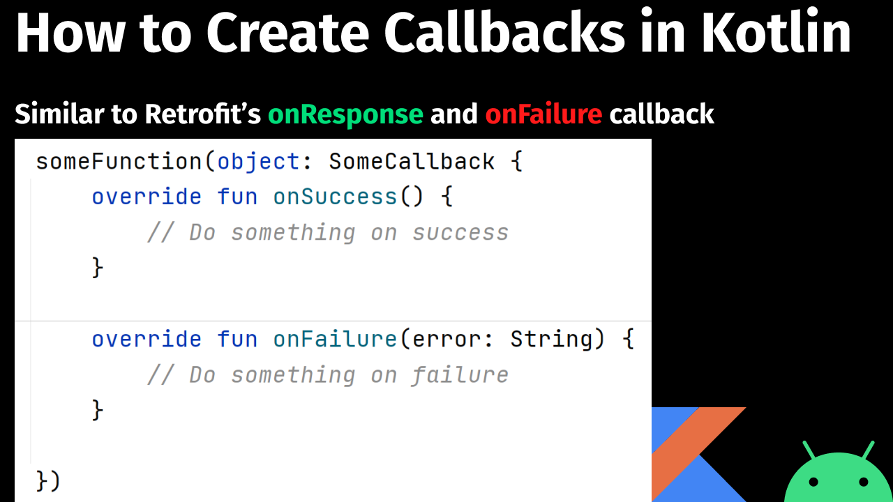

<h1 align="center">Callback Example Kotlin</h1></br>

<p align="center">
How to create Callbacks in Kotlin?
</p>
<br>

<p align="center">
Video Instructions: https://youtu.be/B-vb9porLPc
</p>

<br>

<p align="center">
  <a href="#"></a>
  <a href="https://github.com/androiddevnotes"></a>

</p>

<br>
<p align="center">
</img>
</p>

<br>

## Code

[MainActivity.kt](app/src/main/java/com/androiddevnotes/lee/MainActivity.kt)

```kotlin 
class MainActivity : AppCompatActivity() {
    override fun onCreate(savedInstanceState: Bundle?) {
        super.onCreate(savedInstanceState)
        setContentView(R.layout.activity_main)

        val textView: TextView = findViewById(R.id.textView)

        fun someFunction(someCallback: SomeCallback) {
            val word = "nice"
            val letter = "12345"

            if (word.contains(letter)) {
                someCallback.onSuccess()
            } else {
                someCallback.onFailure("$word does not contain $letter")
            }
        }

        textView.setOnClickListener {
            someFunction(object : SomeCallback {
                override fun onSuccess() {
                    Toast.makeText(this@MainActivity, "Inside Success", Toast.LENGTH_SHORT).show()
                }

                override fun onFailure(error: String) {
                    Toast.makeText(this@MainActivity, "Inside Failure - $error", Toast.LENGTH_SHORT)
                        .show()
                }
            })
        }
    }
}

interface SomeCallback {
    fun onSuccess()
    fun onFailure(error: String)
}
```

<br>

## :computer: Find us on

<div align="center">
	<a href="https://github.com/androiddevnotes"> GitHub </a> / <a href="https://discord.gg/vBnEhuC"> Discord </a> / <a href="https://twitter.com/androiddevnotes"> Twitter </a> / <a href="https://www.instagram.com/androiddevnotes"> Instagram </a> / <a href="https://www.youtube.com/channel/UCQATLaT0xKkSm-KKVQzpu0Q"> YouTube </a> / <a href="https://medium.com/@androiddevnotes"> Medium </a>
	<br><br>
    </img>
</div>